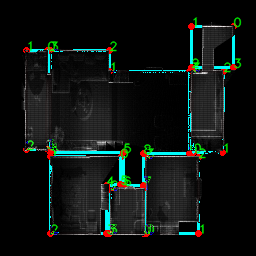

# SlamMap2Floorplan

## Overview

`SlamMap2Floorplan.py` is a Python script that converts SLAM-generated maps (PGM format) into floor plan outline. It processes occupancy grid maps, extracts wall structures, and generates vector-based floor plans in SVG format.

## Features

- Loads SLAM maps from `.pgm` files with optional `.yaml` metadata.
- Preprocesses the map to extract binary representations of walls and free space.
- Uses edge detection and Hough Transform to identify walls.
- Generates contours to approximate room structures.
- Outputs results in image and SVG formats.

## Prerequisites

Ensure you have Python installed (>=3.7). You can install the required dependencies using:

```bash
pip install opencv-python numpy pyyaml matplotlib svgwrite
```

## Usage

Run the script from the command line:

```bash
python SlamMap2Floorplan.py --pgm_path <path_to_pgm> --yaml_path <path_to_yaml> --output_dir <output_directory>
```

### Arguments

- `--pgm_path` (str, required): Path to the PGM file (SLAM map).
- `--yaml_path` (str, optional, default: `../data/room1.yaml`): Path to the YAML metadata file.
- `--output_dir` (str, optional, default: `output_floorplans`): Directory to save output files.

### Example

```bash
python SlamMap2Floorplan.py --pgm_path ./maps/room1.pgm --yaml_path ./maps/room1.yaml --output_dir ./output
```

## Output Files

The script generates several output files:

- `<image_name>_floor_plan_gt.png`: Extracted walls overlay on Ground-truth.
- `<image_name>_floor_plan.png`: Extracted wall structures.
- `<image_name>_contour_floor_plan_gt.png`: Contour-based extracted walls overlay on Ground-truth.
- `<image_name>_contour_floor_plan.png`: Contour-based extracted floor plan.
- `<image_name>_floor_plan.svg`: Vector representation of the floor plan.

## Code Structure

- `load_map()`: Loads PGM and YAML metadata.
- `preprocess_map()`: Converts the grayscale map into a binary representation.
- `extract_walls()`: Uses edge detection and Hough Transform to find walls.
- `lines_to_contours()`: Converts detected walls into contour-based polygons.
- `save_vector_output()`: Saves the extracted floor plan as an SVG file.
- `get_floorplan()`: Main function orchestrating the pipeline.

## How It Works

1. Load Map:
    - Reads the .pgm file and optional .yaml metadata.
    - Extracts resolution, origin, and thresholds for occupied and free spaces.

2. Preprocess Map:
    - Binarizes the map based on thresholds.
    - Cleans the map using morphological operations.

3. Extract Walls:
    - Detects edges using Canny edge detection.
    - Extracts wall lines using Hough Transform.

4. Convert Walls to Polygons:
    - Converts wall lines to contours.
    - Approximates contours as polygons.

5. Save Results:

    - Saves the processed maps as .png images.
    - Saves the vector representation as an .svg file.

## My Observations

I first applied the Canny edge detector to identify wall edges and then used the Hough Transform to detect straight lines representing walls. However, due to edge discontinuities, accurately reconstructing a floor plan proved difficult. Instead of continuous wall structures, many short, disconnected lines were detected.

To improve the representation, I experimented with line merging and corner detection, aiming for a cleaner output, but the results were still unsatisfactory. I also fine-tuned multiple parameters, such as threshold values, minimum line length, gap tolerance, and kernel shapes in morphological operations. While these adjustments helped reconstruct wall lines that aligned better with the ground truth, the results were still not optimal, as shown in the following image:

 


To overcome these limitations, I explored data-driven learning-based approaches like RoomFormer, which excels at corner detection for floor plan generation from 3D point cloud data. I created a standalone inference script, [inference.py](../RoomFormer/inference.py), to test the model. The pretrained model performs well on its original dataset, as demonstrated in the following images:

 

However, the model does not generalize well to unseen data, such as our SLAM-generated maps, as shown below:

 

This poor performance is expected due to the domain gap. The original model was trained on density images derived from 3D point cloud data, whereas I used a binarized version of our SLAM map. However, I believe that training the model with well-prepared, domain-specific data could yield significantly better results.

Check out the [RoomFormer](../RoomFormer/) and some [outputs](../RoomFormer/solution) for our slmap maps data.
